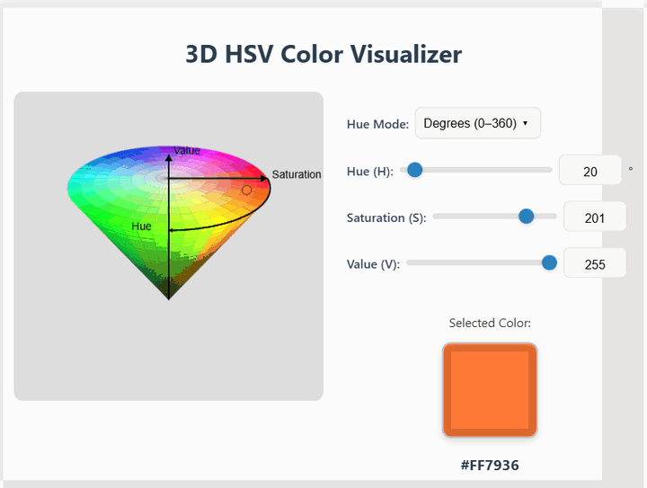
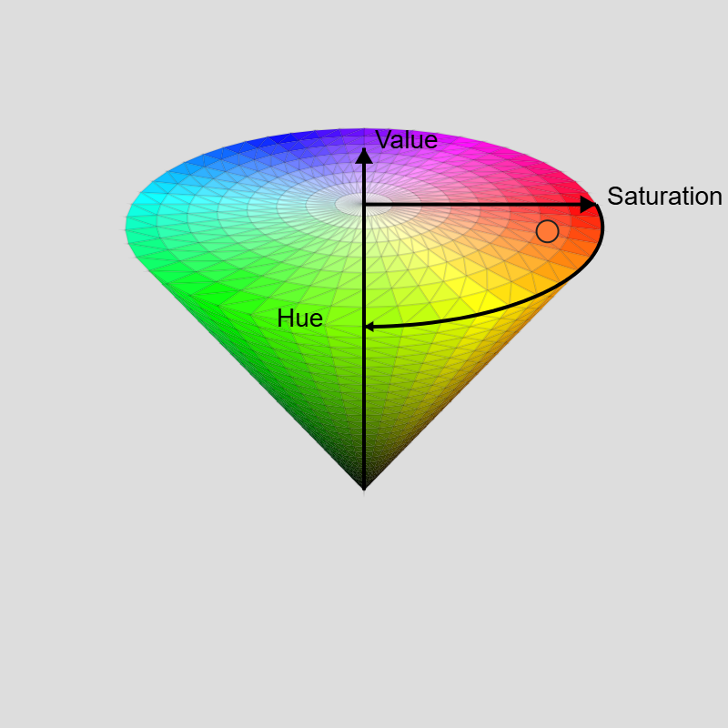

# 3D HSV Color Visualizer

An interactive 3D cone of the HSV colour space, drawn with a hand-written camera and perspective projection on a plain 2D canvas.

**Live demo:** https://matinmonshizadeh.github.io/3D-HSV-Color-Visualizer/





[](LICENSE)

## Overview

This is a personal project I built to get a feel for how the HSV colour model maps onto a solid shape. It renders the HSV cone in 3D and lets you pick a colour with sliders while a marker shows where that colour sits on the cone. It uses no libraries: the orbit camera, the world-to-view transform, the perspective projection, the depth sorting and the HSV to RGB conversion are all written from scratch in about 500 lines of JavaScript. It is a single static page, so it runs by opening `index.html` or from GitHub Pages.

## Features

- 3D HSV cone with a full hue disc on top and the black apex at the bottom
- Sliders and number boxes for Hue, Saturation and Value
- Marker on the cone for the selected colour, drawn as a dashed ring when it is on the far side
- Live colour preview with RGB and HEX
- Hue in degrees (0-360) or in the OpenCV range (0-179), converted exactly
- Drag with the mouse, a finger or a pen to orbit the view; the motion is eased so it stays smooth
- Sharp rendering on HiDPI screens and at every responsive breakpoint

## How it works

**Cone geometry.** Hue is the angle around the vertical axis, Saturation is the distance from the axis, and Value is the height. The cone stands on its apex: V = 0 is the black point at the origin and V = 255 is the coloured disc at the top. A colour maps to the point with angle H, height V/255 x HEIGHT and radius S/255 x RADIUS x V/255. The mesh is 48 hue segments by 24 rings for the side and 8 saturation rings for the disc, each triangle coloured with the HSV value at its centre.

**Camera.** An orbit camera sits on a sphere around the middle of the cone. Two angles (azimuth and elevation) give its position, and a look-at basis is built from it: forward points at the target, right is forward x world-up, and up is right x forward. Elevation is clamped just short of the poles so the basis never degenerates.

**Projection.** Each world point is expressed in the camera basis, then projected with a pinhole model: screen x = cx + f x / z, screen y = cy - f y / z. Points on or behind the near plane are flagged and culled instead of drawn. The mesh is built once in world space; every frame, faces facing away from the camera are dropped using the analytic surface normal, and the rest are projected, sorted far to near and filled in that order (painter's algorithm). Edge strokes are skipped while the view is moving and drawn once it settles.

**HSV to RGB.** The standard sector formula: chroma c = v s, the secondary component x = c (1 - |(h/60 mod 2) - 1|), and an offset m = v - c added to each channel. Hue is wrapped into [0, 360) so 360 and 0 both give red.

**OpenCV hue mode.** OpenCV stores 8-bit hue as degrees / 2 so it fits in a byte, giving a range of 0-179. In this mode the slider runs 0-179 and the value is doubled before conversion, so 179 maps to 358 degrees exactly as it does in OpenCV.

## Usage

Open the live demo: https://matinmonshizadeh.github.io/3D-HSV-Color-Visualizer/

Or run it locally. There is nothing to install or build:

```bash
git clone https://github.com/matinmonshizadeh/3D-HSV-Color-Visualizer.git
cd 3D-HSV-Color-Visualizer
```

Then open `index.html` in a browser, or serve the folder:

```bash
python -m http.server 8000
```

and visit http://localhost:8000.

## Project structure

```
.
├── index.html      page markup and controls
├── styles.css      layout and styling
├── src/
│   └── app.js      state, camera, projection, colour, drawing, events
├── docs/           demo GIF and screenshot
├── LICENSE
└── README.md
```

## Limitations and future work

- Depth is handled with back-face culling plus a painter's sort, not a depth buffer, so rendering is limited to convex shapes like this cone.
- There is no lighting or shading; every triangle is a flat HSV colour.
- The view can only be rotated. Zoom, keyboard control and a WebGL renderer would be natural next steps.

## License

MIT. See [LICENSE](LICENSE).
